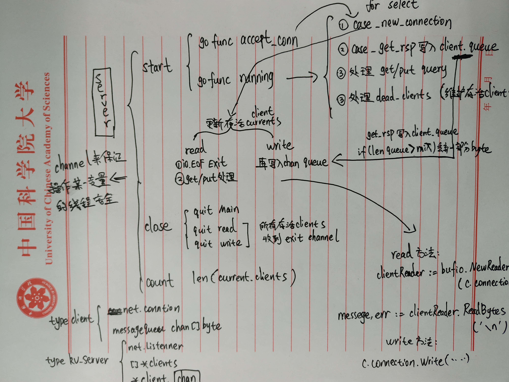

**1.KV数据库的架构&各项功能**   


**2.kv数据库伪代码**   


**3.总结 interface用来统一接口**  
 ```go
package main                                                                           

import (
    "fmt"
)
type Man interface {
    name() string;
    age() int;
}

type Woman struct {
}

func (woman Woman) name() string {
   return "Jin Yawei"
}
func (woman Woman) age() int {
   return 23;
}

type Men struct {
}

func ( men Men) name() string {
   return "liweibin";
}
func ( men Men) age() int {
    return 27;
}

func main(){
    var man Man;

    man = new(Woman);
    fmt.Println( man.name());
    fmt.Println( man.age());
    man = new(Men);
    fmt.Println( man.name());
    fmt.Println( man.age());
}
```
